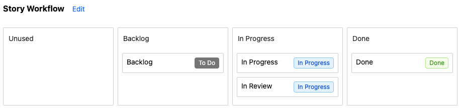

## Project settings

To configure a project, select the "settings" button on the project list:

This brings up the project settings page:

From this page you can rename the project, and configure workflows, the definition of 'completed' work, and default cycle time policies. This will make reporting over your work processes faster and more convenient.

## Define completed work

### Why you should define 'completed' work

Not every closed Jira issue is completed. "Won't Do" items may be moved straight from the backlog to Done, or may be started and then abandoned. For reporting purposes, it's important to define how you wish to account for work which does not have a resolution of "Done".

### Default completed work filter

Jira Flow Metrics lets you configure a **default completed work filter**. This filter will be applied to all reports which deal with "completed" work: the cycle time scatterplot and histogram; the throughput report; the forecast report. These reports assume you are typically interested in work which was actually completed, since this is what you will typically be optimising for.

For example, without this filter, if the Product Owner closes a number of backlog issues with a "Won't Do" resolution, the team's average cycle time will drop thanks to a batch of issues with zero cycle time, despite no meaningful work having occurred!

When syncing a new project, Jira Team Metrics creates a default completed work filter to include only issues with the 'Done' resolution (if it exists in the project).

### A note on team-managed projects

At the time of writing, Jira team-managed projects do not support resolutions. You may wish to use labels instead (e.g. `wont-fix`, `duplicate`, etc.), which can be used in the default completed work filter in the same way:

TODO: screenshot

## Workflows

### What is a workflow?

A workflow groups statuses into categories that you wish to report over.

For example, the default workflow for a project will group statuses by their Jira status category (To Do, In Progress and Done). This lets you report over cycle times according to these categories.

However, you might be interested in more granular workflow stages.

For example, suppose a mobile team contributes features to a mobile app with a regular fortnightly release schedule. Once their work is finished they might mark it with a status of `Pending Release` until their changes are released to customers. To understand their internal development processes they would look at cycle times to the `Pending Release` status, but to understand total cycle times to customers they would look at cycle times to `Done`. This team could configure workflow stages like this:

Having done so, the team can now report over cycle times both to Done and to Release by selecting the appropriate workflow stages in the cycle time policy for the report:

### Configuring workflows

You can configure workflows for both stories and epics. To do this, select the `Edit` button next to the workflow on the project settings page. Here you can drag and drop statuses between workflow stages, and create, rename or delete stages.

## Default cycle time policies

You can customise cycle time policies on individual reports, but it's convenient to define defaults. You can specify a default cycle time policy for both stories and epics.

## Next steps

Now that you've configured your project, you can more easily report over your project's flow metrics.
