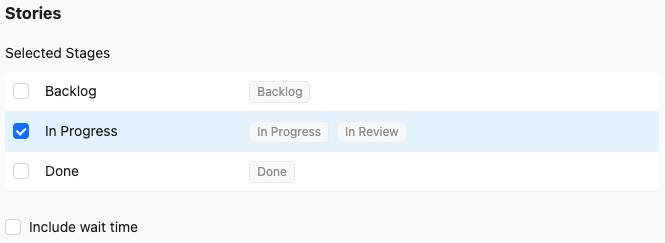
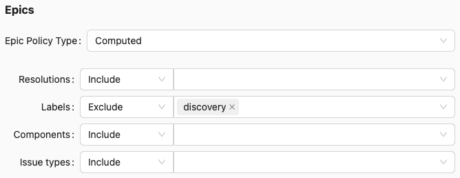

## Cycle Time Policies

To measure cycle times for stories you need to define the workflow stages between which you wish to measure the time taken. For example, you may wish to measure from ideation through to delivery to the customer, or you may be interested in optimising individual stages in your process (e.g. review and QA).

You can customise the measurement policies for both stories and epics on individual reports, and you can also configure defaults for the project.

### Status Cycle Time Policies

Story cycle time policies are always defined in terms of workflow statuses. You can select which stages should be counted as "in progress", and cycle times will be measured by time spent in those statuses.

The `include wait time` option determines how to account for time that an issue is not in progress according to the selected statuses. For example, if an issue is started, then paused (e.g. moved back to the backlog), then restarted and completed, the wait time while the issue is paused won't be counted towards the cycle time by default, but will be if the checkbox is checked.

### Computed Cycle Time Policies

Epic cycle time policies may be defined in terms of statuses, but it's surprisingly hard to keep the status of Jira epics in sync with the work being done, so this isn't always ideal. Reasons for this include:

1. Epics may be used simply as a container for work. Teams don't always have a well defined epic workflow.
2. Even if a team has a defined epic workflow, it's easy to forget to update the epic status as it is scoped, started and completed.
3. A common activity for an Agile/Lean coach or consultant is to explore prior team data. Unless the team has already been disciplined about its use of Jira, chances are epic status histories won't be accurate.

To assist with this problem, Jira Team Metrics lets you define **computed** cycle time policies for epics. These are computed based on the individual issues done within them, as measured according to the story cycle time policy.

For example, with no additional filters applied, a computed epic cycle time policy will determine epic flow attributes as follows:

- The **started** time will be the time the first issue in the epic was started.
- The **completed** time will be the time the last completed issue in the epic was completed.
- The **cycle time** will be the difference between these two times.

### Advanced use cases

Suppose a team represents product discovery work in Jira using tasks labelled with the `discovery` label. If you're reporting over ideation-to-customer cycle times then you would want to include these tasks in epic cycle times. But if you're more interested in software implementation cycle times, you might want to exclude discovery tasks. You can define a filter to exclude issues with this label from counting towards the epic cycle times, so the computed cycle times will be for the implementation time only:

## Next Steps

Now that you understand cycle time policies, you may wish to [configure your project]( "Configure Your Project") to make reporting easier and faster with meaningful defaults.
