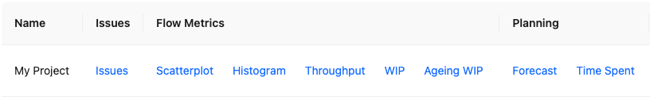
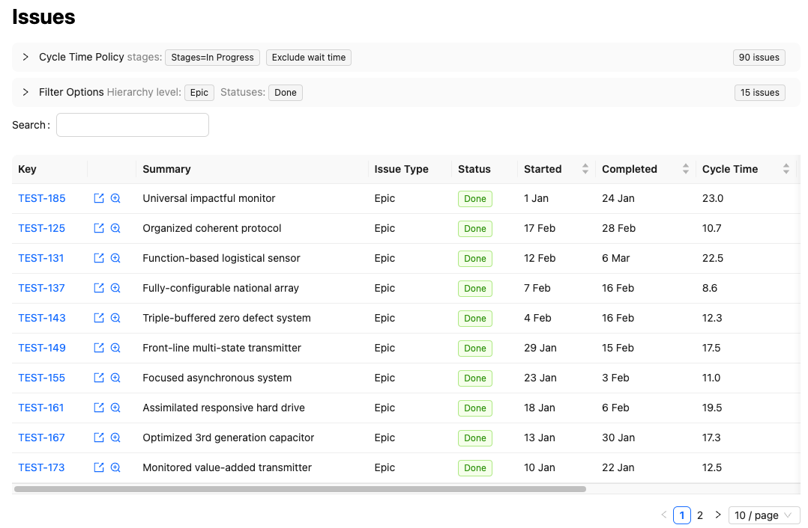
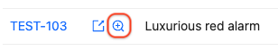
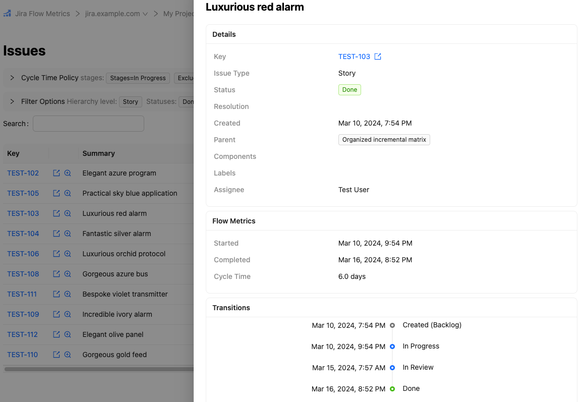
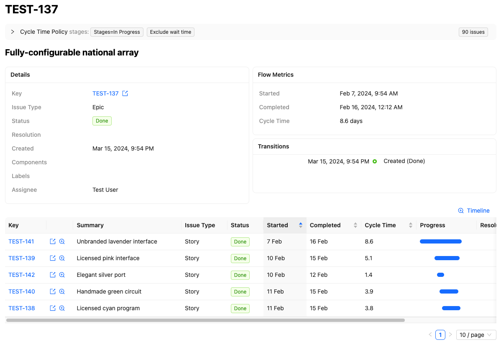
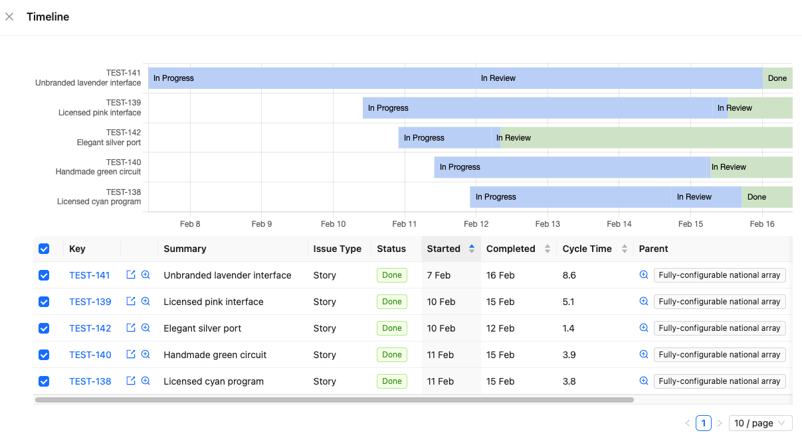
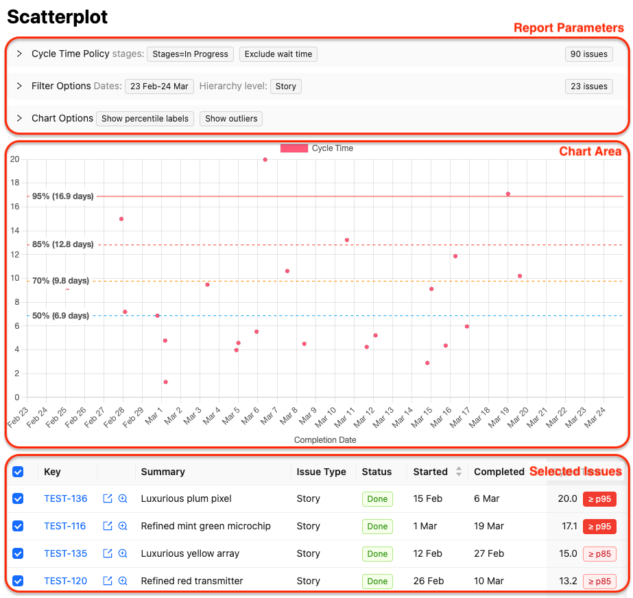

From the projects index page you can see links to various reports which will help you understand your team's performance.



## Browse issues

The `Issues` link takes you to the project issues page, from which you can browse and search all issues synced in the project.



In addition to the expected attributes (status, assignee, issue type, etc.) there are a few additional features which are useful for drilling down into specific issues and epics to see what happened.

### Issue details and preview pane

To quickly inspect an issue, you can use the preview button:



This will show a preview pane over the list, which will include details such as flow metrics and the transition timeline for that issue.



The issue details page contains the same information, but renders as a full page with its own link.

### Issue flow metrics

Jira Flow Metrics computes cycle times based on the specified cycle time policy. This metric (along with the computed started and completed dates) is shown in all issue lists, on the issue details page, and in the issue preview pane.



For more about cycle time policies, see the [cycle time policies]( "Cycle Time Policies") guide.

### Epic timeline

Above the list of child issues in an epic (on both the details page, as in the above screenshot, and on the epic preview pane) there is a `timeline` link. Clicking this link shows a detailed timeline of all issues in the epic: when they transitioned between statuses, and when they were completed.



## Flow metric reports

The flow metric reports help you understand the capabilities of your work processes.

### What are flow metrics?

The fundamental flow metrics are cycle time, throughput and work in progress (WIP), which are connected over a given time period by Little's Law:

```math {.text-center}
$$
\text{Avg. WIP} = \text{Avg. Throughput} \times \text{Avg. Cycle Time}
$$
```

Cycle time is the measure of how long it takes the work system to produce an item (whether a story, epic or some other issue type). Throughput is the number of work items produced in a given time period. WIP is the number of items in progress in the system.

Per the [DORA research model](https://dora.dev/research/), continuous delivery practices predict high performing technology teams and organisations. Flow metrics can help visualise problems and assist in identifying opportunities for improvement, including for continuous delivery and other Lean purposes (e.g. reducing waste, improving quality, and producing value for customers).

### Example: cycle time scatterplot

For a more thorough explanation of these reports see [Flow Metric Reports]( "Flow Metric Reports"). But for now, we can take a look at the cycle time scatterplot to get a feel for how these reports work.



This report is divided into three areas:

1. The report parameters. The specific parameters vary across reports, but all have `Cycle Time Policy` and certain `Filter Options`, and most have configurable `Chart Options` specific to the report.

2. The chart area. This visualises the metrics of interest. Note that, as with most reports, percentiles are displayed alonside the data points to help you get a sense of typical and unlikely cases. In this example we can see the median cycle time is 6.9 days, but (from the 95th percentile) one in twenty issues takes 17 days or more.

3. The selected issues list. This isn't shown on all charts, but in the case of the scatterplot chart you manually select or deselect issues to display. This can be helpful to exclude outliers or bad data when exploring past performance.

## Planning reports

In addition to the flow metric reports, there are also reports geared towards planning:

1. The `Time Spent` report estimates (based on time spent in progress) how much time was spent on each epic in a given time period. This can assist with timesheet reporting (if you're unfortunate enough to be doing this), and can be a quick way to estimate costs regardless.

2. The `Forecast` report uses historical data to predict how long a particular project of known scope (estimated in terms of story count or epic count) will take.

## Next steps

Now that you've learned the basics, you may wish to do one of the following:

1. Learn about [cycle time policies]( "Cycle Time Policies"), to understand the options for measuring cycle times.
2. [Configure your project]( "Configure Your Project") to make reporting easier and faster with meaningful defaults.
