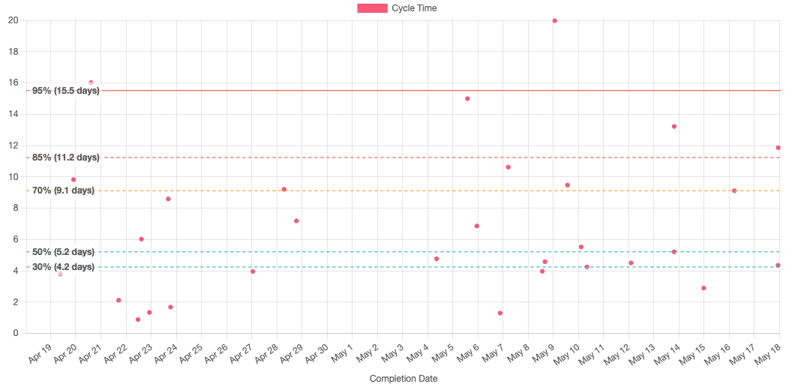
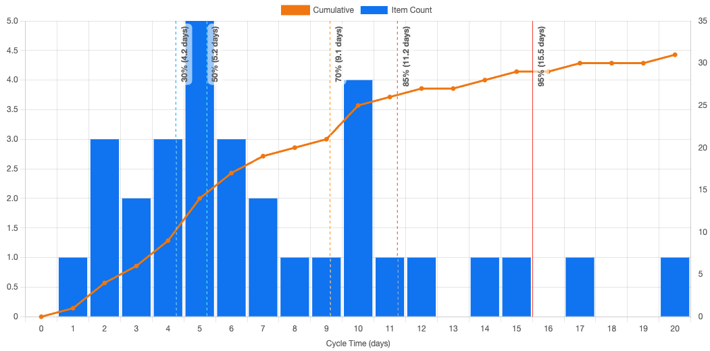
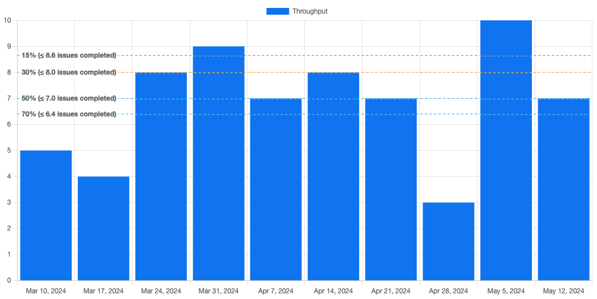
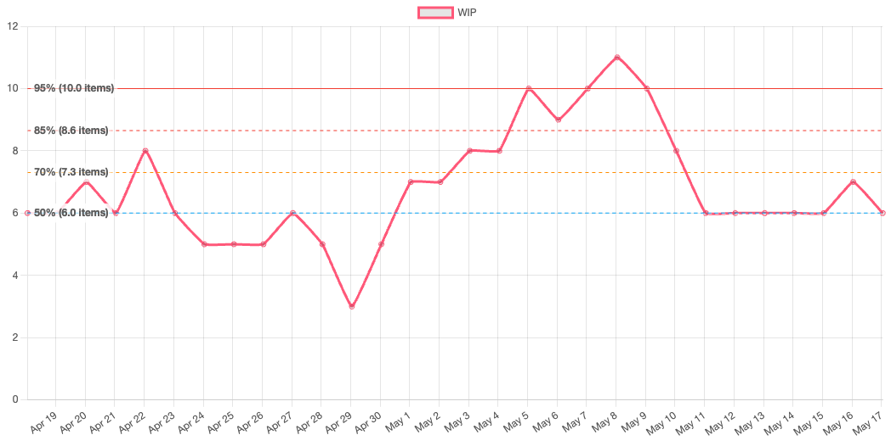
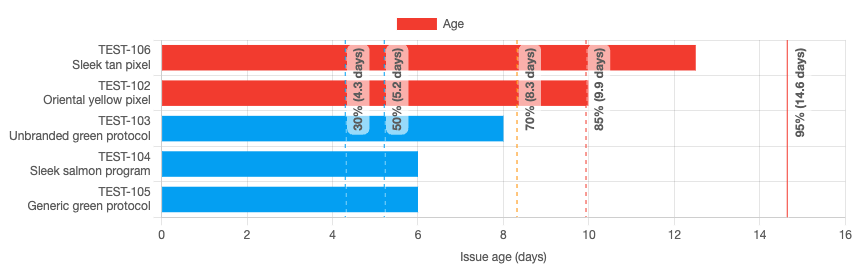

## Cycle time reports

### Scatterplot

This report shows the cycle times of completed issues plotted against the date they were completed. This can help you quickly identify issues which took an unusually long time, in order to drill-down and understand the causes.

### Histogram

This report also shows cycle times, but it does so in a Pareto chart to visualise the distribution of cycle times. Insights can be drawn from the shape of this distribution. For more on this, see Troy Magennis' [Understanding Cycle Time Distribution Shapes](https://observablehq.com/@troymagennis/understanding-cycle-time-distribution-shapes) or Alexis Zheglov's [The Weibull Training Wheels](https://connected-knowledge.com/2019/10/22/the-weibull-training-wheels/) for more on this topic.

## Throughput report

The throughput report shows the team's throughput over a given time unit (day, week, fortnight or month). The percentiles can help you understand typical throughput. For example, if a team has a median throughput of 12 issues per fortnight, then 12 issues might be a reasonable target scope for a two week sprint.

## WIP reports

### WIP

The Work In Progress (WIP) report shows how many work items were in progress at a given point in time. This can help you spot problems such as queues forming (in dev teams, this often happens in review or QA, or if waiting on an external dependency). You should aim to control WIP: limits on work in progress should prompt teamwork to address the problem when a queue starts to form.

### Ageing WIP

The Ageing WIP report can be used as a leading indicator of problems. As issue age you can see them cut across cycle time percentiles. The older an issue gets, the more likely it is to continue ageing. Certain thresholds can be used to prompt teamwork in order to prevent worst cases (e.g. a team may decide to swarm on a difficult problem).

