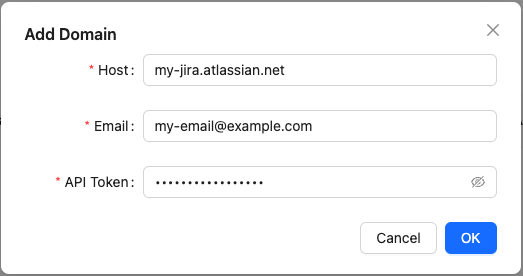
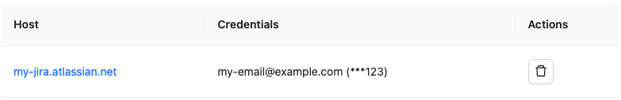
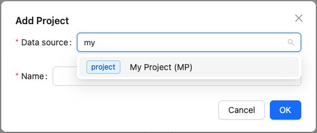
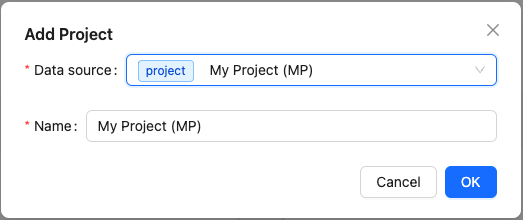
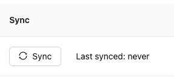
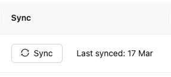

Get set up with Jira Flow Metrics.

## Installation

To run the app, clone the repository and run the `bootstrap.sh` script:

```bash
git clone git@github.com:agileplanning-io/jira-flow-metrics.git
cd jira-flow-metrics
./bootstrap
```

The app will now be running at <http://localhost:3000>.

## Add a Jira domain

### Create an API token

First, you'll need an API token so that Jira Flow Metrics can read your Jira data. You can do this from <https://id.atlassian.com/manage-profile/security/api-tokens>.

See also [Manage API tokens for your Atlassian Account](https://support.atlassian.com/atlassian-account/docs/manage-api-tokens-for-your-atlassian-account/) for more about Jira API tokens.

### Configure your Jira domain

Once you have a token, you can configure the domain in Jira Flow Metrics:

1. Go to <http://localhost:3000/domains> and select `Add Domain` to bring up the Add Domain dialog.
2. Add the hostname for your Jira instance, your Jira email, and your API access token.<br>
   
3. Click `OK` and your domain will be added to the list of available domains.

## Configure a project

### Add a project

Now you can configure a metrics project. This can be based on either a Jira project or a Jira filter.

1. Select your domain from the list at <http://localhost:3000/domains>.<br>
   
2. Select `Add Project` to bring up the Add Project dialog.
3. Type to search for a data source (either the name of a project or a filter) and select it from the list.<br>
   
4. Accept the default name or give it a new one, and click `OK`.<br>
   

### Sync the project data with Jira

Finally, you need to sync the data with Jira. Syncs must be triggered manually: you can do this from the projects list, or from the footer of any report.

1. Find the project in the project list. For the project you just added, note that by the sync button is the time of the last sync, which is currently `never`.<br>
   
2. Click the `Sync` button. If your domain is correctly configured then Jira Flow Metrics will sync your Jira data.<br>
   

Be aware that until this app reaches version 1, there are some caveats listed in [Under Development]( "Under Development"). In particular, synced data may not be backwards compatible if you upgrade the version you're running.

### Configure default cycle time policies

If you're lucky, your team keeps its Jira data exactly up to date, moving Epics through the Jira workflow exactly as work in them is started and completed.

But if you're like most agile coaches / scum masters / managers, you'll know that Jira makes it very easy to forget about this. Stories will be moved through columns on the Scrum / Kanban board, but epics often get forgotten. Thus, epic status histories tell you little about how features are delivered.

Jira Flow Metrics lets you define computed cycle time policies for epics to get around this. For more on this see [Cycle Time Policies]( "Cycle Time Policies") and [Configure Your Project]( "Configure Your Project").

## Next steps

Once you've created a project, you can [explore your data]( "Explore Your Data").
