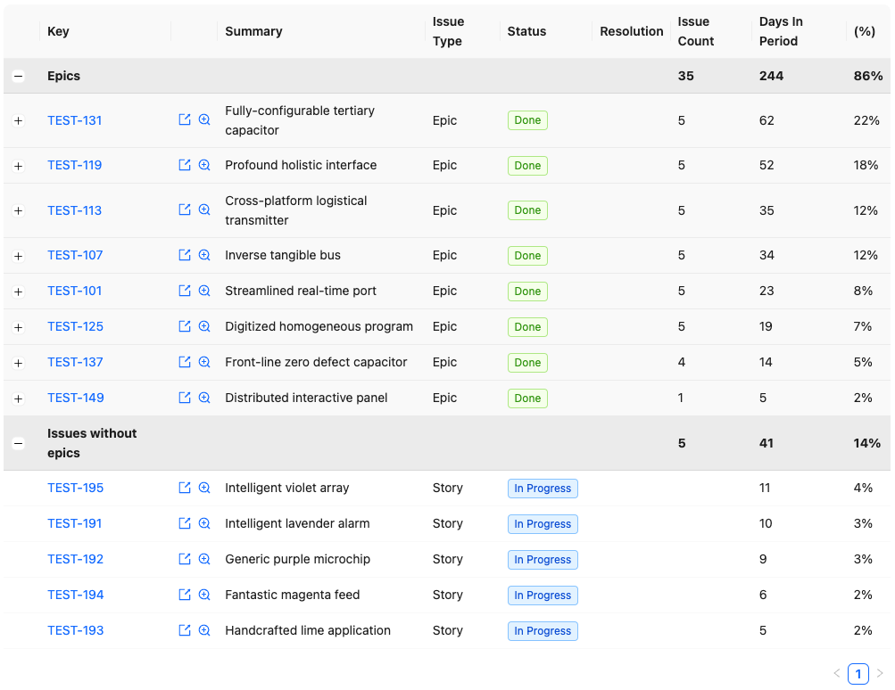
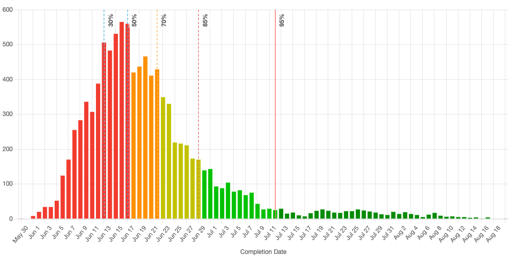

## Time spent report

The Time Spent report shows how much time has been spent across different issues and epics. This can be helpful if you want to estimate development costs across different features, or to simply get a sense of where time is being spent.

## Forecast report

The Forecast report lets you forecast how long work will take, and when it might be done. It does this with a Monte Carlo simulation based on historical cycle time and throughput data. The resulting chart shows the likelihood of the specified scope being completed by a given date.

### Chart options

- `Include long tail`: by default, the chart removes the long tail of very unlikely cases to better visualise the likely range. Check this to show all possible outcomes based on the Monte Carlo simulation.
- `Include lead times`: check this if you're forecasting for a new project. When checked, the simulation will include ramp up time for the first issue to be started from scratch. If you're reforecasting for an in progress project then you should uncheck this.
- `Exclude cycle time outliers`: check this if you want to remove cycle time outliers from lead time forecasts. Only relevant if `Include lead times` is checked.

### Tips for forecasting

#### Pick the right hierarchy level

For projects composed of multiple epics, forecast based on the number of epics (not the total number of stories in those epics). This will give better results, because work often generates work (bugs and edge cases are discovered as work progresses), to the total number of stories in a fixed set of epics will likely grow.

#### Pick the right confidence level

If you're simply forecasting capacity, then the median confidence level may be sufficient.

If you're forecasting for a project with a deadline, you probably want more confidence: you might pick 85th confidence level or higher.

In all cases, keep in mind that forecasts are based on how the team previously worked. Clearly the forecast won't predict exceptional circumstances (surprise changes in scope, team members leaving, etc.)
