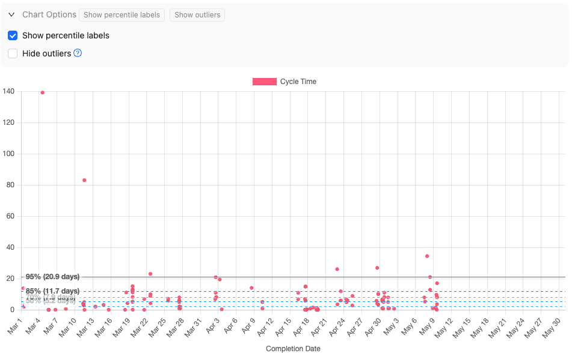
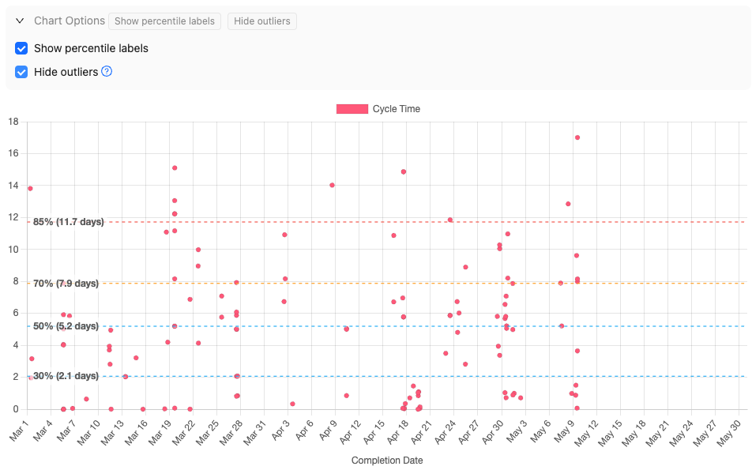

There are a few common options which are used across reports.

## Hide outliers

On cycle time reports, checking the `Hide outliers` option will hide outliers on the chart. It will _not_ affect percentiles or other computation based on the underlying data sets.

For example, if you have a cycle time chart with some serious outliers, it can be difficult to see the distribution of cycle times for typical work:

Here's the same scatterplot with outliers hidden. Note that the percentiles are the same, but we are zoomed in on the more typical range of cycle times.

Outliers are computed using [Tukey's fences method](https://en.wikipedia.org/wiki/Outlier#Tukey's_fences).

## Include stopped issues

On WIP reports, checking the `Include stopped issues` option will display issues which were started but then stopped again.

There are downsides to both options:

- If you check `Include stopped issues` then, unless your team has never moved a started issue back to the backlog, then WIP count will be inflated compared to what is _actually in progress_.

- If you uncheck the `Include stopped issues` option, then issues which were started and then stopped again won't show up on the WIP chart, so you may be undercounting.

Providing your team is reasonably disciplined and doesn't frequently abandon issues, then leaving this option unchecked is reasonable, and hence is the default.
